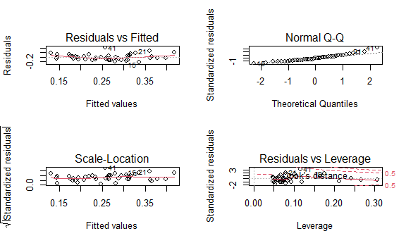

P8130: Biostats I - Final Project
================
Daniel Ojeranti, David Nemirovsky, Ford Holland, Jared Klug, Justin
Vargas
12/18/2020

Read and tidy data:

``` r
hate_crimes_df = 
  read_csv("./HateCrimes.csv") %>% 
  mutate(
    unemployment = as.factor(unemployment), 
    urbanization = as.factor(urbanization),
    hate_crimes_per_100k_splc = as.numeric(hate_crimes_per_100k_splc)
  ) %>% 
  drop_na()
```

EDA:

``` r
hate_crimes_df %>% 
  ggplot(aes(x = hate_crimes_per_100k_splc)) + 
  geom_histogram()
```


Variable Selection:

``` r
par(mar = c(4,5,1,1))
corr_data = 
  hate_crimes_df %>% 
  select(- unemployment, - urbanization, - state)
cor(corr_data[,c(1, 2, 3, 4, 5, 6)]) %>%  
  corrplot(method = "circle", type = "upper", diag = FALSE)
```

    ## Warning in corrplot(., method = "circle", type = "upper", diag = FALSE): Not
    ## been able to calculate text margin, please try again with a clean new empty
    ## window using {plot.new(); dev.off()} or reduce tl.cex


``` r
# Potential multicollinearity btwn perc_non_white and perc_non_citizen

model_1 = lm(hate_crimes_per_100k_splc ~ unemployment + urbanization + median_household_income + perc_population_with_high_school_degree + perc_non_citizen + gini_index + perc_non_white, data = hate_crimes_df)

summary(model_1)
```

    ## 
    ## Call:
    ## lm(formula = hate_crimes_per_100k_splc ~ unemployment + urbanization + 
    ##     median_household_income + perc_population_with_high_school_degree + 
    ##     perc_non_citizen + gini_index + perc_non_white, data = hate_crimes_df)
    ## 
    ## Residuals:
    ##      Min       1Q   Median       3Q      Max 
    ## -0.36552 -0.10314 -0.01316  0.09731  0.51389 
    ## 
    ## Coefficients:
    ##                                           Estimate Std. Error t value Pr(>|t|)
    ## (Intercept)                             -8.296e+00  1.908e+00  -4.349 0.000103
    ## unemploymentlow                          1.307e-02  7.173e-02   0.182 0.856425
    ## urbanizationlow                          3.309e-02  8.475e-02   0.390 0.698475
    ## median_household_income                 -1.504e-06  5.961e-06  -0.252 0.802193
    ## perc_population_with_high_school_degree  5.382e+00  1.835e+00   2.933 0.005735
    ## perc_non_citizen                         1.233e+00  1.877e+00   0.657 0.515332
    ## gini_index                               8.624e+00  1.973e+00   4.370 9.67e-05
    ## perc_non_white                          -5.842e-03  3.673e-01  -0.016 0.987396
    ##                                            
    ## (Intercept)                             ***
    ## unemploymentlow                            
    ## urbanizationlow                            
    ## median_household_income                    
    ## perc_population_with_high_school_degree ** 
    ## perc_non_citizen                           
    ## gini_index                              ***
    ## perc_non_white                             
    ## ---
    ## Signif. codes:  0 '***' 0.001 '**' 0.01 '*' 0.05 '.' 0.1 ' ' 1
    ## 
    ## Residual standard error: 0.2014 on 37 degrees of freedom
    ## Multiple R-squared:  0.461,  Adjusted R-squared:  0.3591 
    ## F-statistic: 4.521 on 7 and 37 DF,  p-value: 0.001007

``` r
# Remove perc_non_white

model_2 = lm(hate_crimes_per_100k_splc ~ unemployment + urbanization + median_household_income + perc_population_with_high_school_degree + perc_non_citizen + gini_index, data = hate_crimes_df)

summary(model_2)
```

    ## 
    ## Call:
    ## lm(formula = hate_crimes_per_100k_splc ~ unemployment + urbanization + 
    ##     median_household_income + perc_population_with_high_school_degree + 
    ##     perc_non_citizen + gini_index, data = hate_crimes_df)
    ## 
    ## Residuals:
    ##      Min       1Q   Median       3Q      Max 
    ## -0.36516 -0.10256 -0.01341  0.09717  0.51338 
    ## 
    ## Coefficients:
    ##                                           Estimate Std. Error t value Pr(>|t|)
    ## (Intercept)                             -8.303e+00  1.831e+00  -4.535 5.62e-05
    ## unemploymentlow                          1.334e-02  6.879e-02   0.194  0.84729
    ## urbanizationlow                          3.301e-02  8.349e-02   0.395  0.69478
    ## median_household_income                 -1.518e-06  5.818e-06  -0.261  0.79558
    ## perc_population_with_high_school_degree  5.391e+00  1.721e+00   3.133  0.00333
    ## perc_non_citizen                         1.217e+00  1.554e+00   0.783  0.43846
    ## gini_index                               8.621e+00  1.941e+00   4.441 7.48e-05
    ##                                            
    ## (Intercept)                             ***
    ## unemploymentlow                            
    ## urbanizationlow                            
    ## median_household_income                    
    ## perc_population_with_high_school_degree ** 
    ## perc_non_citizen                           
    ## gini_index                              ***
    ## ---
    ## Signif. codes:  0 '***' 0.001 '**' 0.01 '*' 0.05 '.' 0.1 ' ' 1
    ## 
    ## Residual standard error: 0.1987 on 38 degrees of freedom
    ## Multiple R-squared:  0.461,  Adjusted R-squared:  0.3759 
    ## F-statistic: 5.417 on 6 and 38 DF,  p-value: 0.0003982

``` r
# Remove unemployment

model_3 = lm(hate_crimes_per_100k_splc ~ urbanization + median_household_income + perc_population_with_high_school_degree + perc_non_citizen + gini_index, data = hate_crimes_df)

summary(model_3)
```

    ## 
    ## Call:
    ## lm(formula = hate_crimes_per_100k_splc ~ urbanization + median_household_income + 
    ##     perc_population_with_high_school_degree + perc_non_citizen + 
    ##     gini_index, data = hate_crimes_df)
    ## 
    ## Residuals:
    ##      Min       1Q   Median       3Q      Max 
    ## -0.37123 -0.10827 -0.01111  0.09475  0.51139 
    ## 
    ## Coefficients:
    ##                                           Estimate Std. Error t value Pr(>|t|)
    ## (Intercept)                             -8.319e+00  1.806e+00  -4.605 4.32e-05
    ## urbanizationlow                          3.477e-02  8.197e-02   0.424  0.67371
    ## median_household_income                 -1.438e-06  5.732e-06  -0.251  0.80317
    ## perc_population_with_high_school_degree  5.443e+00  1.678e+00   3.243  0.00243
    ## perc_non_citizen                         1.211e+00  1.534e+00   0.789  0.43462
    ## gini_index                               8.560e+00  1.892e+00   4.525 5.53e-05
    ##                                            
    ## (Intercept)                             ***
    ## urbanizationlow                            
    ## median_household_income                    
    ## perc_population_with_high_school_degree ** 
    ## perc_non_citizen                           
    ## gini_index                              ***
    ## ---
    ## Signif. codes:  0 '***' 0.001 '**' 0.01 '*' 0.05 '.' 0.1 ' ' 1
    ## 
    ## Residual standard error: 0.1963 on 39 degrees of freedom
    ## Multiple R-squared:  0.4605, Adjusted R-squared:  0.3913 
    ## F-statistic: 6.657 on 5 and 39 DF,  p-value: 0.0001437

``` r
# Remove median household income

model_4 = lm(hate_crimes_per_100k_splc ~ urbanization + perc_population_with_high_school_degree + perc_non_citizen + gini_index, data = hate_crimes_df)

summary(model_4)
```

    ## 
    ## Call:
    ## lm(formula = hate_crimes_per_100k_splc ~ urbanization + perc_population_with_high_school_degree + 
    ##     perc_non_citizen + gini_index, data = hate_crimes_df)
    ## 
    ## Residuals:
    ##      Min       1Q   Median       3Q      Max 
    ## -0.37212 -0.11590 -0.01221  0.09509  0.50813 
    ## 
    ## Coefficients:
    ##                                         Estimate Std. Error t value Pr(>|t|)
    ## (Intercept)                             -8.09030    1.54174  -5.248 5.36e-06
    ## urbanizationlow                          0.03635    0.08076   0.450    0.655
    ## perc_population_with_high_school_degree  5.12116    1.06948   4.788 2.32e-05
    ## perc_non_citizen                         1.02954    1.33670   0.770    0.446
    ## gini_index                               8.51632    1.86148   4.575 4.54e-05
    ##                                            
    ## (Intercept)                             ***
    ## urbanizationlow                            
    ## perc_population_with_high_school_degree ***
    ## perc_non_citizen                           
    ## gini_index                              ***
    ## ---
    ## Signif. codes:  0 '***' 0.001 '**' 0.01 '*' 0.05 '.' 0.1 ' ' 1
    ## 
    ## Residual standard error: 0.194 on 40 degrees of freedom
    ## Multiple R-squared:  0.4596, Adjusted R-squared:  0.4056 
    ## F-statistic: 8.505 on 4 and 40 DF,  p-value: 4.596e-05

``` r
# Remove urbanization

model_5 = lm(hate_crimes_per_100k_splc ~ perc_population_with_high_school_degree + perc_non_citizen + gini_index, data = hate_crimes_df)

summary(model_5)
```

    ## 
    ## Call:
    ## lm(formula = hate_crimes_per_100k_splc ~ perc_population_with_high_school_degree + 
    ##     perc_non_citizen + gini_index, data = hate_crimes_df)
    ## 
    ## Residuals:
    ##      Min       1Q   Median       3Q      Max 
    ## -0.36746 -0.10713 -0.01483  0.09552  0.52395 
    ## 
    ## Coefficients:
    ##                                         Estimate Std. Error t value Pr(>|t|)
    ## (Intercept)                              -7.9264     1.4835  -5.343 3.70e-06
    ## perc_population_with_high_school_degree   5.0624     1.0511   4.816 2.02e-05
    ## perc_non_citizen                          0.6672     1.0567   0.631    0.531
    ## gini_index                                8.3497     1.8065   4.622 3.75e-05
    ##                                            
    ## (Intercept)                             ***
    ## perc_population_with_high_school_degree ***
    ## perc_non_citizen                           
    ## gini_index                              ***
    ## ---
    ## Signif. codes:  0 '***' 0.001 '**' 0.01 '*' 0.05 '.' 0.1 ' ' 1
    ## 
    ## Residual standard error: 0.1921 on 41 degrees of freedom
    ## Multiple R-squared:  0.4569, Adjusted R-squared:  0.4171 
    ## F-statistic:  11.5 on 3 and 41 DF,  p-value: 1.327e-05

``` r
# Remove perc_non_citizen

model_6 = lm(hate_crimes_per_100k_splc ~ perc_population_with_high_school_degree + gini_index, data = hate_crimes_df)

summary(model_6)
```

    ## 
    ## Call:
    ## lm(formula = hate_crimes_per_100k_splc ~ perc_population_with_high_school_degree + 
    ##     gini_index, data = hate_crimes_df)
    ## 
    ## Residuals:
    ##      Min       1Q   Median       3Q      Max 
    ## -0.33490 -0.11891 -0.03105  0.11430  0.52418 
    ## 
    ## Coefficients:
    ##                                         Estimate Std. Error t value Pr(>|t|)
    ## (Intercept)                               -8.103      1.447  -5.601 1.48e-06
    ## perc_population_with_high_school_degree    5.059      1.044   4.847 1.74e-05
    ## gini_index                                 8.825      1.630   5.413 2.76e-06
    ##                                            
    ## (Intercept)                             ***
    ## perc_population_with_high_school_degree ***
    ## gini_index                              ***
    ## ---
    ## Signif. codes:  0 '***' 0.001 '**' 0.01 '*' 0.05 '.' 0.1 ' ' 1
    ## 
    ## Residual standard error: 0.1907 on 42 degrees of freedom
    ## Multiple R-squared:  0.4516, Adjusted R-squared:  0.4255 
    ## F-statistic: 17.29 on 2 and 42 DF,  p-value: 3.32e-06

``` r
# cleaner method for backwards selection

model_all = lm(hate_crimes_per_100k_splc ~ . - state, data = hate_crimes_df)
summary(model_all)
```

    ## 
    ## Call:
    ## lm(formula = hate_crimes_per_100k_splc ~ . - state, data = hate_crimes_df)
    ## 
    ## Residuals:
    ##      Min       1Q   Median       3Q      Max 
    ## -0.36552 -0.10314 -0.01316  0.09731  0.51389 
    ## 
    ## Coefficients:
    ##                                           Estimate Std. Error t value Pr(>|t|)
    ## (Intercept)                             -8.296e+00  1.908e+00  -4.349 0.000103
    ## unemploymentlow                          1.307e-02  7.173e-02   0.182 0.856425
    ## urbanizationlow                          3.309e-02  8.475e-02   0.390 0.698475
    ## median_household_income                 -1.504e-06  5.961e-06  -0.252 0.802193
    ## perc_population_with_high_school_degree  5.382e+00  1.835e+00   2.933 0.005735
    ## perc_non_citizen                         1.233e+00  1.877e+00   0.657 0.515332
    ## gini_index                               8.624e+00  1.973e+00   4.370 9.67e-05
    ## perc_non_white                          -5.842e-03  3.673e-01  -0.016 0.987396
    ##                                            
    ## (Intercept)                             ***
    ## unemploymentlow                            
    ## urbanizationlow                            
    ## median_household_income                    
    ## perc_population_with_high_school_degree ** 
    ## perc_non_citizen                           
    ## gini_index                              ***
    ## perc_non_white                             
    ## ---
    ## Signif. codes:  0 '***' 0.001 '**' 0.01 '*' 0.05 '.' 0.1 ' ' 1
    ## 
    ## Residual standard error: 0.2014 on 37 degrees of freedom
    ## Multiple R-squared:  0.461,  Adjusted R-squared:  0.3591 
    ## F-statistic: 4.521 on 7 and 37 DF,  p-value: 0.001007

``` r
step_1 = update(model_all, . ~ . - perc_non_white)
summary(step_1)
```

    ## 
    ## Call:
    ## lm(formula = hate_crimes_per_100k_splc ~ unemployment + urbanization + 
    ##     median_household_income + perc_population_with_high_school_degree + 
    ##     perc_non_citizen + gini_index, data = hate_crimes_df)
    ## 
    ## Residuals:
    ##      Min       1Q   Median       3Q      Max 
    ## -0.36516 -0.10256 -0.01341  0.09717  0.51338 
    ## 
    ## Coefficients:
    ##                                           Estimate Std. Error t value Pr(>|t|)
    ## (Intercept)                             -8.303e+00  1.831e+00  -4.535 5.62e-05
    ## unemploymentlow                          1.334e-02  6.879e-02   0.194  0.84729
    ## urbanizationlow                          3.301e-02  8.349e-02   0.395  0.69478
    ## median_household_income                 -1.518e-06  5.818e-06  -0.261  0.79558
    ## perc_population_with_high_school_degree  5.391e+00  1.721e+00   3.133  0.00333
    ## perc_non_citizen                         1.217e+00  1.554e+00   0.783  0.43846
    ## gini_index                               8.621e+00  1.941e+00   4.441 7.48e-05
    ##                                            
    ## (Intercept)                             ***
    ## unemploymentlow                            
    ## urbanizationlow                            
    ## median_household_income                    
    ## perc_population_with_high_school_degree ** 
    ## perc_non_citizen                           
    ## gini_index                              ***
    ## ---
    ## Signif. codes:  0 '***' 0.001 '**' 0.01 '*' 0.05 '.' 0.1 ' ' 1
    ## 
    ## Residual standard error: 0.1987 on 38 degrees of freedom
    ## Multiple R-squared:  0.461,  Adjusted R-squared:  0.3759 
    ## F-statistic: 5.417 on 6 and 38 DF,  p-value: 0.0003982

``` r
step_2 = update(step_1, . ~ . - unemployment)
summary(step_2)
```

    ## 
    ## Call:
    ## lm(formula = hate_crimes_per_100k_splc ~ urbanization + median_household_income + 
    ##     perc_population_with_high_school_degree + perc_non_citizen + 
    ##     gini_index, data = hate_crimes_df)
    ## 
    ## Residuals:
    ##      Min       1Q   Median       3Q      Max 
    ## -0.37123 -0.10827 -0.01111  0.09475  0.51139 
    ## 
    ## Coefficients:
    ##                                           Estimate Std. Error t value Pr(>|t|)
    ## (Intercept)                             -8.319e+00  1.806e+00  -4.605 4.32e-05
    ## urbanizationlow                          3.477e-02  8.197e-02   0.424  0.67371
    ## median_household_income                 -1.438e-06  5.732e-06  -0.251  0.80317
    ## perc_population_with_high_school_degree  5.443e+00  1.678e+00   3.243  0.00243
    ## perc_non_citizen                         1.211e+00  1.534e+00   0.789  0.43462
    ## gini_index                               8.560e+00  1.892e+00   4.525 5.53e-05
    ##                                            
    ## (Intercept)                             ***
    ## urbanizationlow                            
    ## median_household_income                    
    ## perc_population_with_high_school_degree ** 
    ## perc_non_citizen                           
    ## gini_index                              ***
    ## ---
    ## Signif. codes:  0 '***' 0.001 '**' 0.01 '*' 0.05 '.' 0.1 ' ' 1
    ## 
    ## Residual standard error: 0.1963 on 39 degrees of freedom
    ## Multiple R-squared:  0.4605, Adjusted R-squared:  0.3913 
    ## F-statistic: 6.657 on 5 and 39 DF,  p-value: 0.0001437

``` r
step_3 = update(step_2, . ~ . - median_household_income)
summary(step_3)
```

    ## 
    ## Call:
    ## lm(formula = hate_crimes_per_100k_splc ~ urbanization + perc_population_with_high_school_degree + 
    ##     perc_non_citizen + gini_index, data = hate_crimes_df)
    ## 
    ## Residuals:
    ##      Min       1Q   Median       3Q      Max 
    ## -0.37212 -0.11590 -0.01221  0.09509  0.50813 
    ## 
    ## Coefficients:
    ##                                         Estimate Std. Error t value Pr(>|t|)
    ## (Intercept)                             -8.09030    1.54174  -5.248 5.36e-06
    ## urbanizationlow                          0.03635    0.08076   0.450    0.655
    ## perc_population_with_high_school_degree  5.12116    1.06948   4.788 2.32e-05
    ## perc_non_citizen                         1.02954    1.33670   0.770    0.446
    ## gini_index                               8.51632    1.86148   4.575 4.54e-05
    ##                                            
    ## (Intercept)                             ***
    ## urbanizationlow                            
    ## perc_population_with_high_school_degree ***
    ## perc_non_citizen                           
    ## gini_index                              ***
    ## ---
    ## Signif. codes:  0 '***' 0.001 '**' 0.01 '*' 0.05 '.' 0.1 ' ' 1
    ## 
    ## Residual standard error: 0.194 on 40 degrees of freedom
    ## Multiple R-squared:  0.4596, Adjusted R-squared:  0.4056 
    ## F-statistic: 8.505 on 4 and 40 DF,  p-value: 4.596e-05

``` r
step_4 = update(step_3, . ~ . - urbanization)
summary(step_4)
```

    ## 
    ## Call:
    ## lm(formula = hate_crimes_per_100k_splc ~ perc_population_with_high_school_degree + 
    ##     perc_non_citizen + gini_index, data = hate_crimes_df)
    ## 
    ## Residuals:
    ##      Min       1Q   Median       3Q      Max 
    ## -0.36746 -0.10713 -0.01483  0.09552  0.52395 
    ## 
    ## Coefficients:
    ##                                         Estimate Std. Error t value Pr(>|t|)
    ## (Intercept)                              -7.9264     1.4835  -5.343 3.70e-06
    ## perc_population_with_high_school_degree   5.0624     1.0511   4.816 2.02e-05
    ## perc_non_citizen                          0.6672     1.0567   0.631    0.531
    ## gini_index                                8.3497     1.8065   4.622 3.75e-05
    ##                                            
    ## (Intercept)                             ***
    ## perc_population_with_high_school_degree ***
    ## perc_non_citizen                           
    ## gini_index                              ***
    ## ---
    ## Signif. codes:  0 '***' 0.001 '**' 0.01 '*' 0.05 '.' 0.1 ' ' 1
    ## 
    ## Residual standard error: 0.1921 on 41 degrees of freedom
    ## Multiple R-squared:  0.4569, Adjusted R-squared:  0.4171 
    ## F-statistic:  11.5 on 3 and 41 DF,  p-value: 1.327e-05

``` r
model_fin = update(step_4, . ~ . - perc_non_citizen)
summary(model_fin)
```

    ## 
    ## Call:
    ## lm(formula = hate_crimes_per_100k_splc ~ perc_population_with_high_school_degree + 
    ##     gini_index, data = hate_crimes_df)
    ## 
    ## Residuals:
    ##      Min       1Q   Median       3Q      Max 
    ## -0.33490 -0.11891 -0.03105  0.11430  0.52418 
    ## 
    ## Coefficients:
    ##                                         Estimate Std. Error t value Pr(>|t|)
    ## (Intercept)                               -8.103      1.447  -5.601 1.48e-06
    ## perc_population_with_high_school_degree    5.059      1.044   4.847 1.74e-05
    ## gini_index                                 8.825      1.630   5.413 2.76e-06
    ##                                            
    ## (Intercept)                             ***
    ## perc_population_with_high_school_degree ***
    ## gini_index                              ***
    ## ---
    ## Signif. codes:  0 '***' 0.001 '**' 0.01 '*' 0.05 '.' 0.1 ' ' 1
    ## 
    ## Residual standard error: 0.1907 on 42 degrees of freedom
    ## Multiple R-squared:  0.4516, Adjusted R-squared:  0.4255 
    ## F-statistic: 17.29 on 2 and 42 DF,  p-value: 3.32e-06

``` r
# try using stepwise

model_untrans = step(model_all, direction = "backward")
```

    ## Start:  AIC=-137.03
    ## hate_crimes_per_100k_splc ~ (state + unemployment + urbanization + 
    ##     median_household_income + perc_population_with_high_school_degree + 
    ##     perc_non_citizen + gini_index + perc_non_white) - state
    ## 
    ##                                           Df Sum of Sq    RSS     AIC
    ## - perc_non_white                           1   0.00001 1.5008 -139.03
    ## - unemployment                             1   0.00135 1.5021 -138.99
    ## - median_household_income                  1   0.00258 1.5034 -138.95
    ## - urbanization                             1   0.00618 1.5070 -138.85
    ## - perc_non_citizen                         1   0.01750 1.5183 -138.51
    ## <none>                                                 1.5008 -137.03
    ## - perc_population_with_high_school_degree  1   0.34889 1.8497 -129.62
    ## - gini_index                               1   0.77465 2.2754 -120.30
    ## 
    ## Step:  AIC=-139.03
    ## hate_crimes_per_100k_splc ~ unemployment + urbanization + median_household_income + 
    ##     perc_population_with_high_school_degree + perc_non_citizen + 
    ##     gini_index
    ## 
    ##                                           Df Sum of Sq    RSS     AIC
    ## - unemployment                             1   0.00148 1.5023 -140.99
    ## - median_household_income                  1   0.00269 1.5035 -140.95
    ## - urbanization                             1   0.00617 1.5070 -140.85
    ## - perc_non_citizen                         1   0.02422 1.5250 -140.31
    ## <none>                                                 1.5008 -139.03
    ## - perc_population_with_high_school_degree  1   0.38759 1.8884 -130.69
    ## - gini_index                               1   0.77888 2.2797 -122.22
    ## 
    ## Step:  AIC=-140.99
    ## hate_crimes_per_100k_splc ~ urbanization + median_household_income + 
    ##     perc_population_with_high_school_degree + perc_non_citizen + 
    ##     gini_index
    ## 
    ##                                           Df Sum of Sq    RSS     AIC
    ## - median_household_income                  1   0.00243 1.5047 -142.91
    ## - urbanization                             1   0.00693 1.5092 -142.78
    ## - perc_non_citizen                         1   0.02401 1.5263 -142.27
    ## <none>                                                 1.5023 -140.99
    ## - perc_population_with_high_school_degree  1   0.40517 1.9074 -132.24
    ## - gini_index                               1   0.78876 2.2910 -124.00
    ## 
    ## Step:  AIC=-142.91
    ## hate_crimes_per_100k_splc ~ urbanization + perc_population_with_high_school_degree + 
    ##     perc_non_citizen + gini_index
    ## 
    ##                                           Df Sum of Sq    RSS     AIC
    ## - urbanization                             1   0.00762 1.5123 -144.69
    ## - perc_non_citizen                         1   0.02232 1.5270 -144.25
    ## <none>                                                 1.5047 -142.91
    ## - gini_index                               1   0.78737 2.2921 -125.97
    ## - perc_population_with_high_school_degree  1   0.86254 2.3672 -124.52
    ## 
    ## Step:  AIC=-144.69
    ## hate_crimes_per_100k_splc ~ perc_population_with_high_school_degree + 
    ##     perc_non_citizen + gini_index
    ## 
    ##                                           Df Sum of Sq    RSS     AIC
    ## - perc_non_citizen                         1   0.01471 1.5270 -146.25
    ## <none>                                                 1.5123 -144.69
    ## - gini_index                               1   0.78804 2.3004 -127.81
    ## - perc_population_with_high_school_degree  1   0.85561 2.3679 -126.51
    ## 
    ## Step:  AIC=-146.25
    ## hate_crimes_per_100k_splc ~ perc_population_with_high_school_degree + 
    ##     gini_index
    ## 
    ##                                           Df Sum of Sq    RSS     AIC
    ## <none>                                                 1.5270 -146.25
    ## - perc_population_with_high_school_degree  1   0.85432 2.3813 -128.25
    ## - gini_index                               1   1.06513 2.5922 -124.44

``` r
summary(model_untrans)
```

    ## 
    ## Call:
    ## lm(formula = hate_crimes_per_100k_splc ~ perc_population_with_high_school_degree + 
    ##     gini_index, data = hate_crimes_df)
    ## 
    ## Residuals:
    ##      Min       1Q   Median       3Q      Max 
    ## -0.33490 -0.11891 -0.03105  0.11430  0.52418 
    ## 
    ## Coefficients:
    ##                                         Estimate Std. Error t value Pr(>|t|)
    ## (Intercept)                               -8.103      1.447  -5.601 1.48e-06
    ## perc_population_with_high_school_degree    5.059      1.044   4.847 1.74e-05
    ## gini_index                                 8.825      1.630   5.413 2.76e-06
    ##                                            
    ## (Intercept)                             ***
    ## perc_population_with_high_school_degree ***
    ## gini_index                              ***
    ## ---
    ## Signif. codes:  0 '***' 0.001 '**' 0.01 '*' 0.05 '.' 0.1 ' ' 1
    ## 
    ## Residual standard error: 0.1907 on 42 degrees of freedom
    ## Multiple R-squared:  0.4516, Adjusted R-squared:  0.4255 
    ## F-statistic: 17.29 on 2 and 42 DF,  p-value: 3.32e-06

``` r
plot(model_untrans)
```


Q-Q Plots:

``` r
# Non-transformed

par(mfrow = c(2,2))
plot(model_fin)
```


Transformed:

``` r
library(MASS)
```

    ## Warning: package 'MASS' was built under R version 4.0.3

    ## 
    ## Attaching package: 'MASS'

    ## The following object is masked from 'package:dplyr':
    ## 
    ##     select

``` r
boxcox(model_fin)
```


``` r
# Natural log transformation:

hate_crimes_trans = 
  hate_crimes_df %>% 
  mutate(ln_hate_crimes = log(hate_crimes_per_100k_splc))

model_all_trans = lm(ln_hate_crimes ~ . - state - hate_crimes_per_100k_splc, data = hate_crimes_trans)
summary(model_all_trans)
```

    ## 
    ## Call:
    ## lm(formula = ln_hate_crimes ~ . - state - hate_crimes_per_100k_splc, 
    ##     data = hate_crimes_trans)
    ## 
    ## Residuals:
    ##      Min       1Q   Median       3Q      Max 
    ## -1.28845 -0.41144  0.01898  0.31334  1.13022 
    ## 
    ## Coefficients:
    ##                                           Estimate Std. Error t value Pr(>|t|)
    ## (Intercept)                             -1.857e+01  5.553e+00  -3.344  0.00190
    ## unemploymentlow                          2.179e-01  2.088e-01   1.043  0.30353
    ## urbanizationlow                         -9.885e-02  2.467e-01  -0.401  0.69092
    ## median_household_income                 -4.732e-06  1.735e-05  -0.273  0.78658
    ## perc_population_with_high_school_degree  1.121e+01  5.341e+00   2.098  0.04275
    ## perc_non_citizen                         1.168e+00  5.464e+00   0.214  0.83189
    ## gini_index                               1.670e+01  5.744e+00   2.908  0.00611
    ## perc_non_white                          -1.232e-01  1.069e+00  -0.115  0.90887
    ##                                           
    ## (Intercept)                             **
    ## unemploymentlow                           
    ## urbanizationlow                           
    ## median_household_income                   
    ## perc_population_with_high_school_degree * 
    ## perc_non_citizen                          
    ## gini_index                              **
    ## perc_non_white                            
    ## ---
    ## Signif. codes:  0 '***' 0.001 '**' 0.01 '*' 0.05 '.' 0.1 ' ' 1
    ## 
    ## Residual standard error: 0.5862 on 37 degrees of freedom
    ## Multiple R-squared:  0.3146, Adjusted R-squared:  0.1849 
    ## F-statistic: 2.426 on 7 and 37 DF,  p-value: 0.03768

``` r
# using stepwise

model_trans = step(model_all_trans, direction = "backward")
```

    ## Start:  AIC=-40.88
    ## ln_hate_crimes ~ (state + unemployment + urbanization + median_household_income + 
    ##     perc_population_with_high_school_degree + perc_non_citizen + 
    ##     gini_index + perc_non_white + hate_crimes_per_100k_splc) - 
    ##     state - hate_crimes_per_100k_splc
    ## 
    ##                                           Df Sum of Sq    RSS     AIC
    ## - perc_non_white                           1   0.00456 12.719 -42.859
    ## - perc_non_citizen                         1   0.01570 12.730 -42.820
    ## - median_household_income                  1   0.02556 12.740 -42.785
    ## - urbanization                             1   0.05519 12.770 -42.680
    ## - unemployment                             1   0.37413 13.089 -41.570
    ## <none>                                                 12.715 -40.875
    ## - perc_population_with_high_school_degree  1   1.51318 14.228 -37.815
    ## - gini_index                               1   2.90660 15.621 -33.611
    ## 
    ## Step:  AIC=-42.86
    ## ln_hate_crimes ~ unemployment + urbanization + median_household_income + 
    ##     perc_population_with_high_school_degree + perc_non_citizen + 
    ##     gini_index
    ## 
    ##                                           Df Sum of Sq    RSS     AIC
    ## - perc_non_citizen                         1   0.01114 12.730 -44.820
    ## - median_household_income                  1   0.02946 12.749 -44.755
    ## - urbanization                             1   0.05718 12.777 -44.657
    ## - unemployment                             1   0.41699 13.136 -43.408
    ## <none>                                                 12.719 -42.859
    ## - perc_population_with_high_school_degree  1   1.73309 14.452 -39.111
    ## - gini_index                               1   2.90620 15.626 -35.599
    ## 
    ## Step:  AIC=-44.82
    ## ln_hate_crimes ~ unemployment + urbanization + median_household_income + 
    ##     perc_population_with_high_school_degree + gini_index
    ## 
    ##                                           Df Sum of Sq    RSS     AIC
    ## - median_household_income                  1   0.01910 12.750 -46.752
    ## - urbanization                             1   0.11092 12.841 -46.429
    ## - unemployment                             1   0.41466 13.145 -45.377
    ## <none>                                                 12.730 -44.820
    ## - perc_population_with_high_school_degree  1   1.92883 14.659 -40.471
    ## - gini_index                               1   3.00737 15.738 -37.277
    ## 
    ## Step:  AIC=-46.75
    ## ln_hate_crimes ~ unemployment + urbanization + perc_population_with_high_school_degree + 
    ##     gini_index
    ## 
    ##                                           Df Sum of Sq    RSS     AIC
    ## - urbanization                             1   0.09183 12.841 -48.429
    ## - unemployment                             1   0.40424 13.154 -47.348
    ## <none>                                                 12.750 -46.752
    ## - gini_index                               1   3.02492 15.774 -39.172
    ## - perc_population_with_high_school_degree  1   3.15688 15.906 -38.797
    ## 
    ## Step:  AIC=-48.43
    ## ln_hate_crimes ~ unemployment + perc_population_with_high_school_degree + 
    ##     gini_index
    ## 
    ##                                           Df Sum of Sq    RSS     AIC
    ## - unemployment                             1    0.3655 13.207 -49.166
    ## <none>                                                 12.841 -48.429
    ## - perc_population_with_high_school_degree  1    3.3459 16.187 -40.010
    ## - gini_index                               1    4.0555 16.897 -38.079
    ## 
    ## Step:  AIC=-49.17
    ## ln_hate_crimes ~ perc_population_with_high_school_degree + gini_index
    ## 
    ##                                           Df Sum of Sq    RSS     AIC
    ## <none>                                                 13.207 -49.166
    ## - gini_index                               1    3.7171 16.924 -40.007
    ## - perc_population_with_high_school_degree  1    4.4569 17.664 -38.081

``` r
summary(model_trans)
```

    ## 
    ## Call:
    ## lm(formula = ln_hate_crimes ~ perc_population_with_high_school_degree + 
    ##     gini_index, data = hate_crimes_trans)
    ## 
    ## Residuals:
    ##      Min       1Q   Median       3Q      Max 
    ## -1.34787 -0.39659 -0.00387  0.44892  1.06723 
    ## 
    ## Coefficients:
    ##                                         Estimate Std. Error t value Pr(>|t|)
    ## (Intercept)                              -18.947      4.254  -4.454 6.14e-05
    ## perc_population_with_high_school_degree   11.554      3.069   3.765 0.000512
    ## gini_index                                16.486      4.795   3.438 0.001334
    ##                                            
    ## (Intercept)                             ***
    ## perc_population_with_high_school_degree ***
    ## gini_index                              ** 
    ## ---
    ## Signif. codes:  0 '***' 0.001 '**' 0.01 '*' 0.05 '.' 0.1 ' ' 1
    ## 
    ## Residual standard error: 0.5608 on 42 degrees of freedom
    ## Multiple R-squared:  0.288,  Adjusted R-squared:  0.2541 
    ## F-statistic: 8.496 on 2 and 42 DF,  p-value: 0.0007974

``` r
# QQ plots

par(mfrow = c(2,2))
trans_qq = plot(model_trans)
```


``` r
untrans_qq = plot(model_fin)
```


Remove influential point:

``` r
hate_crimes_no_out = 
  hate_crimes_df %>% 
  filter(state != "District of Columbia")

model_untrans_no_out = lm(hate_crimes_per_100k_splc ~ . - state, data = hate_crimes_no_out)
summary(model_untrans_no_out)
```

    ## 
    ## Call:
    ## lm(formula = hate_crimes_per_100k_splc ~ . - state, data = hate_crimes_no_out)
    ## 
    ## Residuals:
    ##      Min       1Q   Median       3Q      Max 
    ## -0.27113 -0.08632 -0.03593  0.09348  0.45347 
    ## 
    ## Coefficients:
    ##                                           Estimate Std. Error t value Pr(>|t|)
    ## (Intercept)                             -3.086e+00  1.895e+00  -1.628   0.1121
    ## unemploymentlow                          1.782e-02  5.748e-02   0.310   0.7583
    ## urbanizationlow                         -5.035e-02  7.023e-02  -0.717   0.4780
    ## median_household_income                 -2.976e-06  4.787e-06  -0.622   0.5381
    ## perc_population_with_high_school_degree  2.898e+00  1.564e+00   1.853   0.0721
    ## perc_non_citizen                         1.568e+00  1.506e+00   1.041   0.3047
    ## gini_index                               2.302e+00  2.085e+00   1.104   0.2769
    ## perc_non_white                          -3.276e-01  3.023e-01  -1.083   0.2858
    ##                                          
    ## (Intercept)                              
    ## unemploymentlow                          
    ## urbanizationlow                          
    ## median_household_income                  
    ## perc_population_with_high_school_degree .
    ## perc_non_citizen                         
    ## gini_index                               
    ## perc_non_white                           
    ## ---
    ## Signif. codes:  0 '***' 0.001 '**' 0.01 '*' 0.05 '.' 0.1 ' ' 1
    ## 
    ## Residual standard error: 0.1614 on 36 degrees of freedom
    ## Multiple R-squared:  0.2576, Adjusted R-squared:  0.1132 
    ## F-statistic: 1.784 on 7 and 36 DF,  p-value: 0.1208

``` r
model_untrans_adj = step(model_untrans_no_out, direction = "backward")
```

    ## Start:  AIC=-153.35
    ## hate_crimes_per_100k_splc ~ (state + unemployment + urbanization + 
    ##     median_household_income + perc_population_with_high_school_degree + 
    ##     perc_non_citizen + gini_index + perc_non_white) - state
    ## 
    ##                                           Df Sum of Sq     RSS     AIC
    ## - unemployment                             1  0.002503 0.93990 -155.23
    ## - median_household_income                  1  0.010064 0.94746 -154.88
    ## - urbanization                             1  0.013384 0.95078 -154.72
    ## - perc_non_citizen                         1  0.028228 0.96562 -154.04
    ## - perc_non_white                           1  0.030567 0.96796 -153.94
    ## - gini_index                               1  0.031743 0.96914 -153.88
    ## <none>                                                 0.93740 -153.35
    ## - perc_population_with_high_school_degree  1  0.089403 1.02680 -151.34
    ## 
    ## Step:  AIC=-155.23
    ## hate_crimes_per_100k_splc ~ urbanization + median_household_income + 
    ##     perc_population_with_high_school_degree + perc_non_citizen + 
    ##     gini_index + perc_non_white
    ## 
    ##                                           Df Sum of Sq     RSS     AIC
    ## - median_household_income                  1  0.009151 0.94905 -156.81
    ## - urbanization                             1  0.012210 0.95211 -156.66
    ## - gini_index                               1  0.030355 0.97025 -155.83
    ## - perc_non_citizen                         1  0.030537 0.97044 -155.82
    ## - perc_non_white                           1  0.036485 0.97638 -155.56
    ## <none>                                                 0.93990 -155.23
    ## - perc_population_with_high_school_degree  1  0.092116 1.03202 -153.12
    ## 
    ## Step:  AIC=-156.81
    ## hate_crimes_per_100k_splc ~ urbanization + perc_population_with_high_school_degree + 
    ##     perc_non_citizen + gini_index + perc_non_white
    ## 
    ##                                           Df Sum of Sq     RSS     AIC
    ## - urbanization                             1  0.010408 0.95946 -158.32
    ## - perc_non_citizen                         1  0.023014 0.97206 -157.75
    ## - gini_index                               1  0.029878 0.97893 -157.44
    ## - perc_non_white                           1  0.040995 0.99005 -156.94
    ## <none>                                                 0.94905 -156.81
    ## - perc_population_with_high_school_degree  1  0.107179 1.05623 -154.10
    ## 
    ## Step:  AIC=-158.33
    ## hate_crimes_per_100k_splc ~ perc_population_with_high_school_degree + 
    ##     perc_non_citizen + gini_index + perc_non_white
    ## 
    ##                                           Df Sum of Sq     RSS     AIC
    ## - perc_non_white                           1  0.039284 0.99874 -158.56
    ## <none>                                                 0.95946 -158.32
    ## - gini_index                               1  0.046311 1.00577 -158.25
    ## - perc_non_citizen                         1  0.050368 1.00983 -158.07
    ## - perc_population_with_high_school_degree  1  0.128618 1.08808 -154.79
    ## 
    ## Step:  AIC=-158.56
    ## hate_crimes_per_100k_splc ~ perc_population_with_high_school_degree + 
    ##     perc_non_citizen + gini_index
    ## 
    ##                                           Df Sum of Sq     RSS     AIC
    ## - perc_non_citizen                         1  0.014257 1.01300 -159.94
    ## <none>                                                 0.99874 -158.56
    ## - gini_index                               1  0.051888 1.05063 -158.33
    ## - perc_population_with_high_school_degree  1  0.246457 1.24520 -150.85
    ## 
    ## Step:  AIC=-159.94
    ## hate_crimes_per_100k_splc ~ perc_population_with_high_school_degree + 
    ##     gini_index
    ## 
    ##                                           Df Sum of Sq    RSS     AIC
    ## <none>                                                 1.0130 -159.94
    ## - gini_index                               1  0.078759 1.0918 -158.64
    ## - perc_population_with_high_school_degree  1  0.245707 1.2587 -152.38

``` r
summary(model_untrans_adj)
```

    ## 
    ## Call:
    ## lm(formula = hate_crimes_per_100k_splc ~ perc_population_with_high_school_degree + 
    ##     gini_index, data = hate_crimes_no_out)
    ## 
    ## Residuals:
    ##      Min       1Q   Median       3Q      Max 
    ## -0.25186 -0.10799 -0.02101  0.09700  0.49954 
    ## 
    ## Coefficients:
    ##                                         Estimate Std. Error t value Pr(>|t|)   
    ## (Intercept)                              -3.8396     1.5151  -2.534  0.01519 * 
    ## perc_population_with_high_school_degree   3.0482     0.9666   3.154  0.00302 **
    ## gini_index                                3.2449     1.8174   1.785  0.08159 . 
    ## ---
    ## Signif. codes:  0 '***' 0.001 '**' 0.01 '*' 0.05 '.' 0.1 ' ' 1
    ## 
    ## Residual standard error: 0.1572 on 41 degrees of freedom
    ## Multiple R-squared:  0.1977, Adjusted R-squared:  0.1585 
    ## F-statistic: 5.051 on 2 and 41 DF,  p-value: 0.01094

``` r
plot(model_untrans_adj)
```


Remove Infl//out in Transformed

``` r
hate_crimes_no_out = 
  hate_crimes_trans %>% 
  filter(state != "District of Columbia")

model_all_trans = lm(ln_hate_crimes ~ . - state - hate_crimes_per_100k_splc, data = hate_crimes_trans)
summary(model_all_trans)
```

    ## 
    ## Call:
    ## lm(formula = ln_hate_crimes ~ . - state - hate_crimes_per_100k_splc, 
    ##     data = hate_crimes_trans)
    ## 
    ## Residuals:
    ##      Min       1Q   Median       3Q      Max 
    ## -1.28845 -0.41144  0.01898  0.31334  1.13022 
    ## 
    ## Coefficients:
    ##                                           Estimate Std. Error t value Pr(>|t|)
    ## (Intercept)                             -1.857e+01  5.553e+00  -3.344  0.00190
    ## unemploymentlow                          2.179e-01  2.088e-01   1.043  0.30353
    ## urbanizationlow                         -9.885e-02  2.467e-01  -0.401  0.69092
    ## median_household_income                 -4.732e-06  1.735e-05  -0.273  0.78658
    ## perc_population_with_high_school_degree  1.121e+01  5.341e+00   2.098  0.04275
    ## perc_non_citizen                         1.168e+00  5.464e+00   0.214  0.83189
    ## gini_index                               1.670e+01  5.744e+00   2.908  0.00611
    ## perc_non_white                          -1.232e-01  1.069e+00  -0.115  0.90887
    ##                                           
    ## (Intercept)                             **
    ## unemploymentlow                           
    ## urbanizationlow                           
    ## median_household_income                   
    ## perc_population_with_high_school_degree * 
    ## perc_non_citizen                          
    ## gini_index                              **
    ## perc_non_white                            
    ## ---
    ## Signif. codes:  0 '***' 0.001 '**' 0.01 '*' 0.05 '.' 0.1 ' ' 1
    ## 
    ## Residual standard error: 0.5862 on 37 degrees of freedom
    ## Multiple R-squared:  0.3146, Adjusted R-squared:  0.1849 
    ## F-statistic: 2.426 on 7 and 37 DF,  p-value: 0.03768

``` r
step_1_trans = update(model_all_trans, . ~ . - perc_non_white)
summary(step_1_trans)
```

    ## 
    ## Call:
    ## lm(formula = ln_hate_crimes ~ unemployment + urbanization + median_household_income + 
    ##     perc_population_with_high_school_degree + perc_non_citizen + 
    ##     gini_index, data = hate_crimes_trans)
    ## 
    ## Residuals:
    ##      Min       1Q   Median       3Q      Max 
    ## -1.28086 -0.41424  0.01974  0.29666  1.14039 
    ## 
    ## Coefficients:
    ##                                           Estimate Std. Error t value Pr(>|t|)
    ## (Intercept)                             -1.872e+01  5.331e+00  -3.512  0.00117
    ## unemploymentlow                          2.235e-01  2.003e-01   1.116  0.27137
    ## urbanizationlow                         -1.005e-01  2.431e-01  -0.413  0.68170
    ## median_household_income                 -5.026e-06  1.694e-05  -0.297  0.76832
    ## perc_population_with_high_school_degree  1.140e+01  5.010e+00   2.275  0.02860
    ## perc_non_citizen                         8.253e-01  4.524e+00   0.182  0.85620
    ## gini_index                               1.665e+01  5.652e+00   2.947  0.00546
    ##                                           
    ## (Intercept)                             **
    ## unemploymentlow                           
    ## urbanizationlow                           
    ## median_household_income                   
    ## perc_population_with_high_school_degree * 
    ## perc_non_citizen                          
    ## gini_index                              **
    ## ---
    ## Signif. codes:  0 '***' 0.001 '**' 0.01 '*' 0.05 '.' 0.1 ' ' 1
    ## 
    ## Residual standard error: 0.5785 on 38 degrees of freedom
    ## Multiple R-squared:  0.3143, Adjusted R-squared:  0.2061 
    ## F-statistic: 2.903 on 6 and 38 DF,  p-value: 0.01982

``` r
step_2_trans = update(step_1_trans, . ~ . - unemployment)
summary(step_2_trans)
```

    ## 
    ## Call:
    ## lm(formula = ln_hate_crimes ~ urbanization + median_household_income + 
    ##     perc_population_with_high_school_degree + perc_non_citizen + 
    ##     gini_index, data = hate_crimes_trans)
    ## 
    ## Residuals:
    ##      Min       1Q   Median       3Q      Max 
    ## -1.38258 -0.41521  0.01799  0.42155  1.01317 
    ## 
    ## Coefficients:
    ##                                           Estimate Std. Error t value Pr(>|t|)
    ## (Intercept)                             -1.899e+01  5.342e+00  -3.554  0.00101
    ## urbanizationlow                         -7.091e-02  2.424e-01  -0.293  0.77143
    ## median_household_income                 -3.692e-06  1.695e-05  -0.218  0.82872
    ## perc_population_with_high_school_degree  1.228e+01  4.963e+00   2.474  0.01782
    ## perc_non_citizen                         7.339e-01  4.537e+00   0.162  0.87234
    ## gini_index                               1.563e+01  5.594e+00   2.793  0.00804
    ##                                           
    ## (Intercept)                             **
    ## urbanizationlow                           
    ## median_household_income                   
    ## perc_population_with_high_school_degree * 
    ## perc_non_citizen                          
    ## gini_index                              **
    ## ---
    ## Signif. codes:  0 '***' 0.001 '**' 0.01 '*' 0.05 '.' 0.1 ' ' 1
    ## 
    ## Residual standard error: 0.5804 on 39 degrees of freedom
    ## Multiple R-squared:  0.2918, Adjusted R-squared:  0.201 
    ## F-statistic: 3.214 on 5 and 39 DF,  p-value: 0.01591

``` r
step_3_trans = update(step_2_trans, . ~ . - median_household_income)
summary(step_3_trans)
```

    ## 
    ## Call:
    ## lm(formula = ln_hate_crimes ~ urbanization + perc_population_with_high_school_degree + 
    ##     perc_non_citizen + gini_index, data = hate_crimes_trans)
    ## 
    ## Residuals:
    ##      Min       1Q   Median       3Q      Max 
    ## -1.38486 -0.40356  0.01683  0.41853  1.02811 
    ## 
    ## Coefficients:
    ##                                          Estimate Std. Error t value Pr(>|t|)
    ## (Intercept)                             -18.39877    4.55814  -4.036 0.000238
    ## urbanizationlow                          -0.06687    0.23877  -0.280 0.780894
    ## perc_population_with_high_school_degree  11.45141    3.16192   3.622 0.000815
    ## perc_non_citizen                          0.26744    3.95195   0.068 0.946383
    ## gini_index                               15.51412    5.50344   2.819 0.007456
    ##                                            
    ## (Intercept)                             ***
    ## urbanizationlow                            
    ## perc_population_with_high_school_degree ***
    ## perc_non_citizen                           
    ## gini_index                              ** 
    ## ---
    ## Signif. codes:  0 '***' 0.001 '**' 0.01 '*' 0.05 '.' 0.1 ' ' 1
    ## 
    ## Residual standard error: 0.5734 on 40 degrees of freedom
    ## Multiple R-squared:  0.291,  Adjusted R-squared:  0.2201 
    ## F-statistic: 4.104 on 4 and 40 DF,  p-value: 0.00703

``` r
step_4_trans = update(step_3_trans, . ~ . - urbanization)
summary(step_4_trans)
```

    ## 
    ## Call:
    ## lm(formula = ln_hate_crimes ~ perc_population_with_high_school_degree + 
    ##     perc_non_citizen + gini_index, data = hate_crimes_trans)
    ## 
    ## Residuals:
    ##      Min       1Q   Median       3Q      Max 
    ## -1.39344 -0.40687  0.02081  0.44697  1.04895 
    ## 
    ## Coefficients:
    ##                                         Estimate Std. Error t value Pr(>|t|)
    ## (Intercept)                             -18.7002     4.3792  -4.270 0.000113
    ## perc_population_with_high_school_degree  11.5595     3.1028   3.725 0.000588
    ## perc_non_citizen                          0.9339     3.1193   0.299 0.766143
    ## gini_index                               15.8207     5.3325   2.967 0.005002
    ##                                            
    ## (Intercept)                             ***
    ## perc_population_with_high_school_degree ***
    ## perc_non_citizen                           
    ## gini_index                              ** 
    ## ---
    ## Signif. codes:  0 '***' 0.001 '**' 0.01 '*' 0.05 '.' 0.1 ' ' 1
    ## 
    ## Residual standard error: 0.5669 on 41 degrees of freedom
    ## Multiple R-squared:  0.2896, Adjusted R-squared:  0.2376 
    ## F-statistic: 5.571 on 3 and 41 DF,  p-value: 0.002667

``` r
model_trans_no_out = update(step_4_trans, . ~ . - perc_non_citizen)
summary(model_trans_no_out)
```

    ## 
    ## Call:
    ## lm(formula = ln_hate_crimes ~ perc_population_with_high_school_degree + 
    ##     gini_index, data = hate_crimes_trans)
    ## 
    ## Residuals:
    ##      Min       1Q   Median       3Q      Max 
    ## -1.34787 -0.39659 -0.00387  0.44892  1.06723 
    ## 
    ## Coefficients:
    ##                                         Estimate Std. Error t value Pr(>|t|)
    ## (Intercept)                              -18.947      4.254  -4.454 6.14e-05
    ## perc_population_with_high_school_degree   11.554      3.069   3.765 0.000512
    ## gini_index                                16.486      4.795   3.438 0.001334
    ##                                            
    ## (Intercept)                             ***
    ## perc_population_with_high_school_degree ***
    ## gini_index                              ** 
    ## ---
    ## Signif. codes:  0 '***' 0.001 '**' 0.01 '*' 0.05 '.' 0.1 ' ' 1
    ## 
    ## Residual standard error: 0.5608 on 42 degrees of freedom
    ## Multiple R-squared:  0.288,  Adjusted R-squared:  0.2541 
    ## F-statistic: 8.496 on 2 and 42 DF,  p-value: 0.0007974

``` r
plot(model_trans_no_out)
```


Compare everything we have so far:

``` r
plot(model_untrans)
```


``` r
plot(model_untrans_adj)
```


``` r
plot(model_trans)
```


New Box Cox:

``` r
hate_crimes_no_dc = 
  hate_crimes_df %>% 
  filter(state != "District of Columbia")

model_adj_all = lm(hate_crimes_per_100k_splc ~ . - state, data = hate_crimes_no_dc)
summary(model_adj_all)
```

    ## 
    ## Call:
    ## lm(formula = hate_crimes_per_100k_splc ~ . - state, data = hate_crimes_no_dc)
    ## 
    ## Residuals:
    ##      Min       1Q   Median       3Q      Max 
    ## -0.27113 -0.08632 -0.03593  0.09348  0.45347 
    ## 
    ## Coefficients:
    ##                                           Estimate Std. Error t value Pr(>|t|)
    ## (Intercept)                             -3.086e+00  1.895e+00  -1.628   0.1121
    ## unemploymentlow                          1.782e-02  5.748e-02   0.310   0.7583
    ## urbanizationlow                         -5.035e-02  7.023e-02  -0.717   0.4780
    ## median_household_income                 -2.976e-06  4.787e-06  -0.622   0.5381
    ## perc_population_with_high_school_degree  2.898e+00  1.564e+00   1.853   0.0721
    ## perc_non_citizen                         1.568e+00  1.506e+00   1.041   0.3047
    ## gini_index                               2.302e+00  2.085e+00   1.104   0.2769
    ## perc_non_white                          -3.276e-01  3.023e-01  -1.083   0.2858
    ##                                          
    ## (Intercept)                              
    ## unemploymentlow                          
    ## urbanizationlow                          
    ## median_household_income                  
    ## perc_population_with_high_school_degree .
    ## perc_non_citizen                         
    ## gini_index                               
    ## perc_non_white                           
    ## ---
    ## Signif. codes:  0 '***' 0.001 '**' 0.01 '*' 0.05 '.' 0.1 ' ' 1
    ## 
    ## Residual standard error: 0.1614 on 36 degrees of freedom
    ## Multiple R-squared:  0.2576, Adjusted R-squared:  0.1132 
    ## F-statistic: 1.784 on 7 and 36 DF,  p-value: 0.1208

``` r
model_adj = step(model_adj_all, direction = "backward")
```

    ## Start:  AIC=-153.35
    ## hate_crimes_per_100k_splc ~ (state + unemployment + urbanization + 
    ##     median_household_income + perc_population_with_high_school_degree + 
    ##     perc_non_citizen + gini_index + perc_non_white) - state
    ## 
    ##                                           Df Sum of Sq     RSS     AIC
    ## - unemployment                             1  0.002503 0.93990 -155.23
    ## - median_household_income                  1  0.010064 0.94746 -154.88
    ## - urbanization                             1  0.013384 0.95078 -154.72
    ## - perc_non_citizen                         1  0.028228 0.96562 -154.04
    ## - perc_non_white                           1  0.030567 0.96796 -153.94
    ## - gini_index                               1  0.031743 0.96914 -153.88
    ## <none>                                                 0.93740 -153.35
    ## - perc_population_with_high_school_degree  1  0.089403 1.02680 -151.34
    ## 
    ## Step:  AIC=-155.23
    ## hate_crimes_per_100k_splc ~ urbanization + median_household_income + 
    ##     perc_population_with_high_school_degree + perc_non_citizen + 
    ##     gini_index + perc_non_white
    ## 
    ##                                           Df Sum of Sq     RSS     AIC
    ## - median_household_income                  1  0.009151 0.94905 -156.81
    ## - urbanization                             1  0.012210 0.95211 -156.66
    ## - gini_index                               1  0.030355 0.97025 -155.83
    ## - perc_non_citizen                         1  0.030537 0.97044 -155.82
    ## - perc_non_white                           1  0.036485 0.97638 -155.56
    ## <none>                                                 0.93990 -155.23
    ## - perc_population_with_high_school_degree  1  0.092116 1.03202 -153.12
    ## 
    ## Step:  AIC=-156.81
    ## hate_crimes_per_100k_splc ~ urbanization + perc_population_with_high_school_degree + 
    ##     perc_non_citizen + gini_index + perc_non_white
    ## 
    ##                                           Df Sum of Sq     RSS     AIC
    ## - urbanization                             1  0.010408 0.95946 -158.32
    ## - perc_non_citizen                         1  0.023014 0.97206 -157.75
    ## - gini_index                               1  0.029878 0.97893 -157.44
    ## - perc_non_white                           1  0.040995 0.99005 -156.94
    ## <none>                                                 0.94905 -156.81
    ## - perc_population_with_high_school_degree  1  0.107179 1.05623 -154.10
    ## 
    ## Step:  AIC=-158.33
    ## hate_crimes_per_100k_splc ~ perc_population_with_high_school_degree + 
    ##     perc_non_citizen + gini_index + perc_non_white
    ## 
    ##                                           Df Sum of Sq     RSS     AIC
    ## - perc_non_white                           1  0.039284 0.99874 -158.56
    ## <none>                                                 0.95946 -158.32
    ## - gini_index                               1  0.046311 1.00577 -158.25
    ## - perc_non_citizen                         1  0.050368 1.00983 -158.07
    ## - perc_population_with_high_school_degree  1  0.128618 1.08808 -154.79
    ## 
    ## Step:  AIC=-158.56
    ## hate_crimes_per_100k_splc ~ perc_population_with_high_school_degree + 
    ##     perc_non_citizen + gini_index
    ## 
    ##                                           Df Sum of Sq     RSS     AIC
    ## - perc_non_citizen                         1  0.014257 1.01300 -159.94
    ## <none>                                                 0.99874 -158.56
    ## - gini_index                               1  0.051888 1.05063 -158.33
    ## - perc_population_with_high_school_degree  1  0.246457 1.24520 -150.85
    ## 
    ## Step:  AIC=-159.94
    ## hate_crimes_per_100k_splc ~ perc_population_with_high_school_degree + 
    ##     gini_index
    ## 
    ##                                           Df Sum of Sq    RSS     AIC
    ## <none>                                                 1.0130 -159.94
    ## - gini_index                               1  0.078759 1.0918 -158.64
    ## - perc_population_with_high_school_degree  1  0.245707 1.2587 -152.38

``` r
summary(model_adj)
```

    ## 
    ## Call:
    ## lm(formula = hate_crimes_per_100k_splc ~ perc_population_with_high_school_degree + 
    ##     gini_index, data = hate_crimes_no_dc)
    ## 
    ## Residuals:
    ##      Min       1Q   Median       3Q      Max 
    ## -0.25186 -0.10799 -0.02101  0.09700  0.49954 
    ## 
    ## Coefficients:
    ##                                         Estimate Std. Error t value Pr(>|t|)   
    ## (Intercept)                              -3.8396     1.5151  -2.534  0.01519 * 
    ## perc_population_with_high_school_degree   3.0482     0.9666   3.154  0.00302 **
    ## gini_index                                3.2449     1.8174   1.785  0.08159 . 
    ## ---
    ## Signif. codes:  0 '***' 0.001 '**' 0.01 '*' 0.05 '.' 0.1 ' ' 1
    ## 
    ## Residual standard error: 0.1572 on 41 degrees of freedom
    ## Multiple R-squared:  0.1977, Adjusted R-squared:  0.1585 
    ## F-statistic: 5.051 on 2 and 41 DF,  p-value: 0.01094

``` r
plot(model_adj)
```


``` r
boxcox(model_adj)
```


``` r
model_adj_no_dc = lm(hate_crimes_per_100k_splc ~ perc_population_with_high_school_degree  + unemployment * gini_index, data = hate_crimes_no_dc)
summary(model_adj_no_dc)
```

    ## 
    ## Call:
    ## lm(formula = hate_crimes_per_100k_splc ~ perc_population_with_high_school_degree + 
    ##     unemployment * gini_index, data = hate_crimes_no_dc)
    ## 
    ## Residuals:
    ##      Min       1Q   Median       3Q      Max 
    ## -0.31275 -0.09883 -0.01172  0.07865  0.46433 
    ## 
    ## Coefficients:
    ##                                         Estimate Std. Error t value Pr(>|t|)   
    ## (Intercept)                              -1.9361     1.7342  -1.116  0.27108   
    ## perc_population_with_high_school_degree   2.9585     0.9814   3.014  0.00451 **
    ## unemploymentlow                          -2.8272     1.3936  -2.029  0.04936 * 
    ## gini_index                               -0.7380     2.6793  -0.275  0.78443   
    ## unemploymentlow:gini_index                6.2451     3.0525   2.046  0.04755 * 
    ## ---
    ## Signif. codes:  0 '***' 0.001 '**' 0.01 '*' 0.05 '.' 0.1 ' ' 1
    ## 
    ## Residual standard error: 0.1528 on 39 degrees of freedom
    ## Multiple R-squared:  0.2784, Adjusted R-squared:  0.2044 
    ## F-statistic: 3.761 on 4 and 39 DF,  p-value: 0.01109

``` r
plot(model_adj_no_dc)
```


No Alaska:

``` r
library("HH")
```

    ## Warning: package 'HH' was built under R version 4.0.3

    ## Loading required package: lattice

    ## Loading required package: grid

    ## Loading required package: latticeExtra

    ## Warning: package 'latticeExtra' was built under R version 4.0.3

    ## 
    ## Attaching package: 'latticeExtra'

    ## The following object is masked from 'package:ggplot2':
    ## 
    ##     layer

    ## Loading required package: multcomp

    ## Warning: package 'multcomp' was built under R version 4.0.3

    ## Loading required package: mvtnorm

    ## Warning: package 'mvtnorm' was built under R version 4.0.3

    ## Loading required package: survival

    ## Loading required package: TH.data

    ## Warning: package 'TH.data' was built under R version 4.0.3

    ## 
    ## Attaching package: 'TH.data'

    ## The following object is masked from 'package:MASS':
    ## 
    ##     geyser

    ## Loading required package: gridExtra

    ## 
    ## Attaching package: 'gridExtra'

    ## The following object is masked from 'package:dplyr':
    ## 
    ##     combine

    ## 
    ## Attaching package: 'HH'

    ## The following object is masked from 'package:purrr':
    ## 
    ##     transpose

``` r
hate_crimes_no_dc_ak = 
  hate_crimes_no_dc %>% 
  filter(state != "Alaska")

par(mfrow = c(2,2))
model_adj_no_dc_ak = lm(hate_crimes_per_100k_splc ~ perc_population_with_high_school_degree + gini_index * unemployment, data = hate_crimes_no_dc_ak)
summary(model_adj_no_dc_ak)
```

    ## 
    ## Call:
    ## lm(formula = hate_crimes_per_100k_splc ~ perc_population_with_high_school_degree + 
    ##     gini_index * unemployment, data = hate_crimes_no_dc_ak)
    ## 
    ## Residuals:
    ##      Min       1Q   Median       3Q      Max 
    ## -0.25044 -0.10931 -0.00453  0.08365  0.35267 
    ## 
    ## Coefficients:
    ##                                         Estimate Std. Error t value Pr(>|t|)
    ## (Intercept)                               0.1234     1.7077   0.072 0.942782
    ## perc_population_with_high_school_degree   3.4931     0.9061   3.855 0.000433
    ## gini_index                               -6.1370     2.9939  -2.050 0.047331
    ## unemploymentlow                          -5.6163     1.5537  -3.615 0.000869
    ## gini_index:unemploymentlow               12.2220     3.3782   3.618 0.000861
    ##                                            
    ## (Intercept)                                
    ## perc_population_with_high_school_degree ***
    ## gini_index                              *  
    ## unemploymentlow                         ***
    ## gini_index:unemploymentlow              ***
    ## ---
    ## Signif. codes:  0 '***' 0.001 '**' 0.01 '*' 0.05 '.' 0.1 ' ' 1
    ## 
    ## Residual standard error: 0.1385 on 38 degrees of freedom
    ## Multiple R-squared:  0.4145, Adjusted R-squared:  0.3529 
    ## F-statistic: 6.726 on 4 and 38 DF,  p-value: 0.0003395

``` r
plot(model_adj_no_dc_ak)
```



``` r
vif(model_adj_no_dc_ak)
```

    ## perc_population_with_high_school_degree                              gini_index 
    ##                                1.908717                                5.711728 
    ##                         unemploymentlow              gini_index:unemploymentlow 
    ##                             1352.017144                             1281.848304

Transformed no DC:

``` r
hate_crimes_trans_no_dc = 
  hate_crimes_trans %>% 
  filter(state != "District of Columbia")

model_adj_trans = lm(ln_hate_crimes ~ . - state - hate_crimes_per_100k_splc, data = hate_crimes_trans_no_dc)
summary(model_adj_trans)
```

    ## 
    ## Call:
    ## lm(formula = ln_hate_crimes ~ . - state - hate_crimes_per_100k_splc, 
    ##     data = hate_crimes_trans_no_dc)
    ## 
    ## Residuals:
    ##      Min       1Q   Median       3Q      Max 
    ## -1.17560 -0.35011  0.02951  0.35998  1.11574 
    ## 
    ## Coefficients:
    ##                                           Estimate Std. Error t value Pr(>|t|)
    ## (Intercept)                             -1.234e+01  6.754e+00  -1.827    0.076
    ## unemploymentlow                          2.235e-01  2.049e-01   1.091    0.283
    ## urbanizationlow                         -1.986e-01  2.503e-01  -0.793    0.433
    ## median_household_income                 -6.492e-06  1.706e-05  -0.380    0.706
    ## perc_population_with_high_school_degree  8.238e+00  5.575e+00   1.478    0.148
    ## perc_non_citizen                         1.568e+00  5.367e+00   0.292    0.772
    ## gini_index                               9.146e+00  7.431e+00   1.231    0.226
    ## perc_non_white                          -5.079e-01  1.078e+00  -0.471    0.640
    ##                                          
    ## (Intercept)                             .
    ## unemploymentlow                          
    ## urbanizationlow                          
    ## median_household_income                  
    ## perc_population_with_high_school_degree  
    ## perc_non_citizen                         
    ## gini_index                               
    ## perc_non_white                           
    ## ---
    ## Signif. codes:  0 '***' 0.001 '**' 0.01 '*' 0.05 '.' 0.1 ' ' 1
    ## 
    ## Residual standard error: 0.5752 on 36 degrees of freedom
    ## Multiple R-squared:  0.2102, Adjusted R-squared:  0.05667 
    ## F-statistic: 1.369 on 7 and 36 DF,  p-value: 0.2481

``` r
model_trans = step(model_adj_trans, direction = "backward")
```

    ## Start:  AIC=-41.5
    ## ln_hate_crimes ~ (state + unemployment + urbanization + median_household_income + 
    ##     perc_population_with_high_school_degree + perc_non_citizen + 
    ##     gini_index + perc_non_white + hate_crimes_per_100k_splc) - 
    ##     state - hate_crimes_per_100k_splc
    ## 
    ##                                           Df Sum of Sq    RSS     AIC
    ## - perc_non_citizen                         1   0.02825 11.938 -43.397
    ## - median_household_income                  1   0.04789 11.957 -43.325
    ## - perc_non_white                           1   0.07348 11.983 -43.231
    ## - urbanization                             1   0.20824 12.118 -42.739
    ## - unemployment                             1   0.39377 12.303 -42.070
    ## - gini_index                               1   0.50111 12.411 -41.688
    ## <none>                                                 11.909 -41.502
    ## - perc_population_with_high_school_degree  1   0.72239 12.632 -40.911
    ## 
    ## Step:  AIC=-43.4
    ## ln_hate_crimes ~ unemployment + urbanization + median_household_income + 
    ##     perc_population_with_high_school_degree + gini_index + perc_non_white
    ## 
    ##                                           Df Sum of Sq    RSS     AIC
    ## - median_household_income                  1   0.03060 11.968 -45.285
    ## - perc_non_white                           1   0.04589 11.984 -45.229
    ## - urbanization                             1   0.33294 12.271 -44.187
    ## - unemployment                             1   0.42320 12.361 -43.865
    ## - gini_index                               1   0.52483 12.463 -43.504
    ## <none>                                                 11.938 -43.397
    ## - perc_population_with_high_school_degree  1   0.69834 12.636 -42.896
    ## 
    ## Step:  AIC=-45.28
    ## ln_hate_crimes ~ unemployment + urbanization + perc_population_with_high_school_degree + 
    ##     gini_index + perc_non_white
    ## 
    ##                                           Df Sum of Sq    RSS     AIC
    ## - perc_non_white                           1   0.09049 12.059 -46.953
    ## - urbanization                             1   0.30273 12.271 -46.186
    ## - unemployment                             1   0.39903 12.367 -45.842
    ## - gini_index                               1   0.51288 12.481 -45.439
    ## <none>                                                 11.968 -45.285
    ## - perc_population_with_high_school_degree  1   0.94584 12.914 -43.938
    ## 
    ## Step:  AIC=-46.95
    ## ln_hate_crimes ~ unemployment + urbanization + perc_population_with_high_school_degree + 
    ##     gini_index
    ## 
    ##                                           Df Sum of Sq    RSS     AIC
    ## - urbanization                             1   0.21612 12.275 -48.172
    ## - unemployment                             1   0.47128 12.530 -47.267
    ## - gini_index                               1   0.53064 12.589 -47.059
    ## <none>                                                 12.059 -46.953
    ## - perc_population_with_high_school_degree  1   1.38655 13.445 -44.164
    ## 
    ## Step:  AIC=-48.17
    ## ln_hate_crimes ~ unemployment + perc_population_with_high_school_degree + 
    ##     gini_index
    ## 
    ##                                           Df Sum of Sq    RSS     AIC
    ## - unemployment                             1    0.4003 12.675 -48.760
    ## <none>                                                 12.275 -48.172
    ## - gini_index                               1    1.0293 13.304 -46.629
    ## - perc_population_with_high_school_degree  1    1.6881 13.963 -44.502
    ## 
    ## Step:  AIC=-48.76
    ## ln_hate_crimes ~ perc_population_with_high_school_degree + gini_index
    ## 
    ##                                           Df Sum of Sq    RSS     AIC
    ## <none>                                                 12.675 -48.760
    ## - gini_index                               1   0.87421 13.549 -47.825
    ## - perc_population_with_high_school_degree  1   2.39135 15.067 -43.155

``` r
summary(model_trans)
```

    ## 
    ## Call:
    ## lm(formula = ln_hate_crimes ~ perc_population_with_high_school_degree + 
    ##     gini_index, data = hate_crimes_trans_no_dc)
    ## 
    ## Residuals:
    ##      Min       1Q   Median       3Q      Max 
    ## -1.26341 -0.43818  0.03534  0.42669  1.10132 
    ## 
    ## Coefficients:
    ##                                         Estimate Std. Error t value Pr(>|t|)   
    ## (Intercept)                              -14.611      5.359  -2.726  0.00938 **
    ## perc_population_with_high_school_degree    9.509      3.419   2.781  0.00814 **
    ## gini_index                                10.811      6.429   1.682  0.10025   
    ## ---
    ## Signif. codes:  0 '***' 0.001 '**' 0.01 '*' 0.05 '.' 0.1 ' ' 1
    ## 
    ## Residual standard error: 0.556 on 41 degrees of freedom
    ## Multiple R-squared:  0.1595, Adjusted R-squared:  0.1185 
    ## F-statistic: 3.889 on 2 and 41 DF,  p-value: 0.02841

``` r
plot(model_trans)
```


``` r
model_adj_trans_no_dc = lm(ln_hate_crimes ~ perc_population_with_high_school_degree * unemployment + unemployment * gini_index , data = hate_crimes_trans_no_dc)
summary(model_adj_trans_no_dc)
```

    ## 
    ## Call:
    ## lm(formula = ln_hate_crimes ~ perc_population_with_high_school_degree * 
    ##     unemployment + unemployment * gini_index, data = hate_crimes_trans_no_dc)
    ## 
    ## Residuals:
    ##      Min       1Q   Median       3Q      Max 
    ## -1.09805 -0.38875  0.09688  0.32555  1.12000 
    ## 
    ## Coefficients:
    ##                                                         Estimate Std. Error
    ## (Intercept)                                               -7.510      7.538
    ## perc_population_with_high_school_degree                    7.560      4.762
    ## unemploymentlow                                          -10.805     10.751
    ## gini_index                                                -1.178     10.159
    ## perc_population_with_high_school_degree:unemploymentlow    1.906      7.060
    ## unemploymentlow:gini_index                                20.548     13.254
    ##                                                         t value Pr(>|t|)
    ## (Intercept)                                              -0.996    0.325
    ## perc_population_with_high_school_degree                   1.588    0.121
    ## unemploymentlow                                          -1.005    0.321
    ## gini_index                                               -0.116    0.908
    ## perc_population_with_high_school_degree:unemploymentlow   0.270    0.789
    ## unemploymentlow:gini_index                                1.550    0.129
    ## 
    ## Residual standard error: 0.5475 on 38 degrees of freedom
    ## Multiple R-squared:  0.2445, Adjusted R-squared:  0.1451 
    ## F-statistic:  2.46 on 5 and 38 DF,  p-value: 0.05021

``` r
plot(model_adj_trans_no_dc)
```


