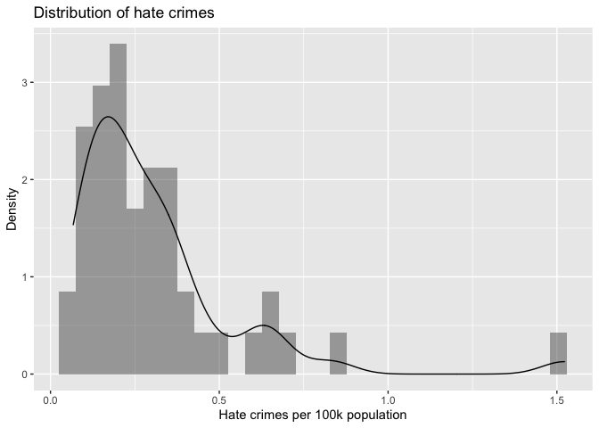
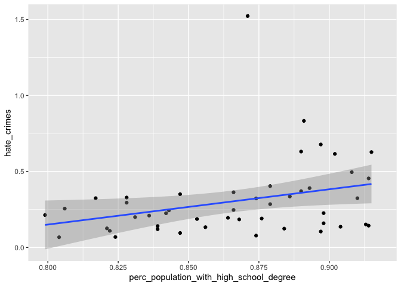
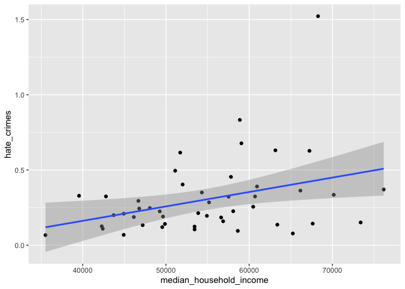
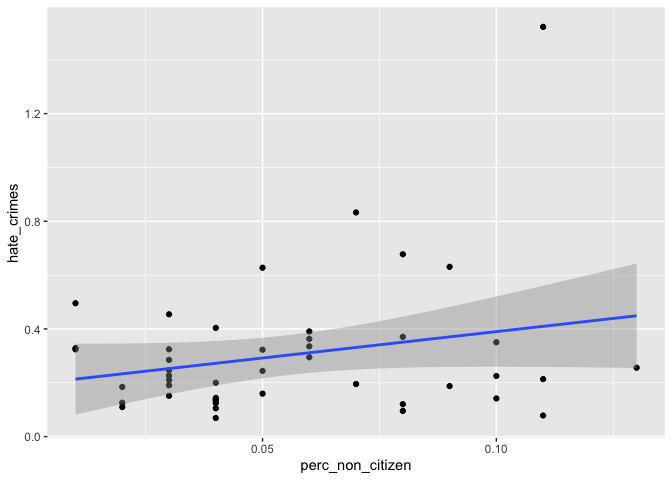
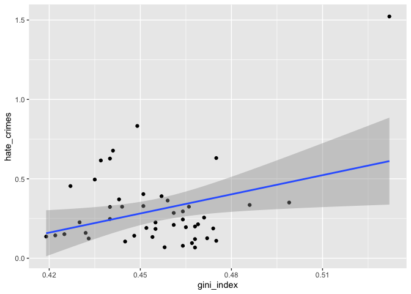
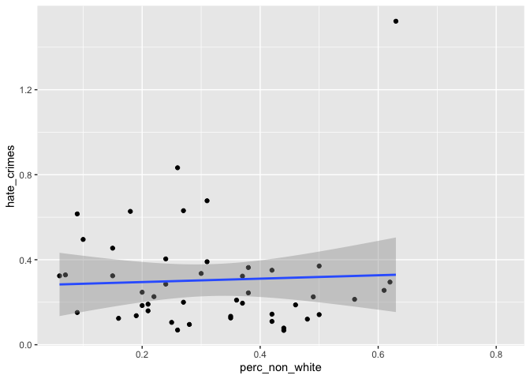

Descrptive statistics
================
12/13/2020

``` r
# read hate crimes data and format categorical variables for tables 
df_hc <- 
  read_csv("HateCrimes.csv") %>% 
  janitor::clean_names() %>% 
  mutate(
    hate_crimes = as.numeric(hate_crimes_per_100k_splc),
    unemp = unemployment %>% str_to_title() %>% factor(levels = c("Low", "High")),
    urban = urbanization %>% str_to_title() %>% factor(levels = c("Low", "High"))
  ) 
```

    ## Parsed with column specification:
    ## cols(
    ##   state = col_character(),
    ##   unemployment = col_character(),
    ##   urbanization = col_character(),
    ##   median_household_income = col_double(),
    ##   perc_population_with_high_school_degree = col_double(),
    ##   perc_non_citizen = col_double(),
    ##   gini_index = col_double(),
    ##   perc_non_white = col_double(),
    ##   hate_crimes_per_100k_splc = col_character()
    ## )

    ## Warning: Problem with `mutate()` input `hate_crimes`.
    ## ℹ NAs introduced by coercion
    ## ℹ Input `hate_crimes` is `as.numeric(hate_crimes_per_100k_splc)`.

    ## Warning in mask$eval_all_mutate(dots[[i]]): NAs introduced by coercion

``` r
# check derivations
df_hc %>% count(unemp, unemployment)
```

    ## # A tibble: 2 x 3
    ##   unemp unemployment     n
    ##   <fct> <chr>        <int>
    ## 1 Low   low             27
    ## 2 High  high            24

``` r
df_hc %>% count(urban, urbanization)
```

    ## # A tibble: 2 x 3
    ##   urban urbanization     n
    ##   <fct> <chr>        <int>
    ## 1 Low   low             27
    ## 2 High  high            24

``` r
# select parsed fields
df_hc <- 
  df_hc %>% 
  select(-c(unemployment, urbanization, hate_crimes_per_100k_splc))

# look at summary
skimr::skim(df_hc)
```

|                                                  |        |
| :----------------------------------------------- | :----- |
| Name                                             | df\_hc |
| Number of rows                                   | 51     |
| Number of columns                                | 9      |
| \_\_\_\_\_\_\_\_\_\_\_\_\_\_\_\_\_\_\_\_\_\_\_   |        |
| Column type frequency:                           |        |
| character                                        | 1      |
| factor                                           | 2      |
| numeric                                          | 6      |
| \_\_\_\_\_\_\_\_\_\_\_\_\_\_\_\_\_\_\_\_\_\_\_\_ |        |
| Group variables                                  |        |

Data summary

**Variable type: character**

| skim\_variable | n\_missing | complete\_rate | min | max | empty | n\_unique | whitespace |
| :------------- | ---------: | -------------: | --: | --: | ----: | --------: | ---------: |
| state          |          0 |              1 |   4 |  20 |     0 |        51 |          0 |

**Variable type: factor**

| skim\_variable | n\_missing | complete\_rate | ordered | n\_unique | top\_counts      |
| :------------- | ---------: | -------------: | :------ | --------: | :--------------- |
| unemp          |          0 |              1 | FALSE   |         2 | Low: 27, Hig: 24 |
| urban          |          0 |              1 | FALSE   |         2 | Low: 27, Hig: 24 |

**Variable type: numeric**

| skim\_variable                               | n\_missing | complete\_rate |     mean |      sd |       p0 |      p25 |      p50 |      p75 |     p100 | hist  |
| :------------------------------------------- | ---------: | -------------: | -------: | ------: | -------: | -------: | -------: | -------: | -------: | :---- |
| median\_household\_income                    |          0 |           1.00 | 55223.61 | 9208.48 | 35521.00 | 48657.00 | 54916.00 | 60719.00 | 76165.00 | ▂▆▇▅▂ |
| perc\_population\_with\_high\_school\_degree |          0 |           1.00 |     0.87 |    0.03 |     0.80 |     0.84 |     0.87 |     0.90 |     0.92 | ▃▅▃▆▇ |
| perc\_non\_citizen                           |          3 |           0.94 |     0.05 |    0.03 |     0.01 |     0.03 |     0.04 |     0.08 |     0.13 | ▇▆▆▂▂ |
| gini\_index                                  |          0 |           1.00 |     0.45 |    0.02 |     0.42 |     0.44 |     0.45 |     0.47 |     0.53 | ▆▇▅▁▁ |
| perc\_non\_white                             |          0 |           1.00 |     0.32 |    0.16 |     0.06 |     0.20 |     0.28 |     0.42 |     0.81 | ▇▇▆▂▁ |
| hate\_crimes                                 |          4 |           0.92 |     0.30 |    0.25 |     0.07 |     0.14 |     0.23 |     0.36 |     1.52 | ▇▂▁▁▁ |

``` r
summary(df_hc$hate_crimes)
```

    ##    Min. 1st Qu.  Median    Mean 3rd Qu.    Max.    NA's 
    ## 0.06745 0.14271 0.22620 0.30409 0.35694 1.52230       4

## Plot hate crime distribution

``` r
# plot distribution of hate crimes data
df_hc %>% 
  ggplot(aes(x = hate_crimes)) +
  geom_histogram(aes(y = ..density..), alpha = 0.5) +
  geom_density(aes(), alpha = 0.5) +
  labs(
    title = "Distribution of hate crimes",
    x = "Hate crimes per 100k population",
    y = "Density"
  )
```

    ## `stat_bin()` using `bins = 30`. Pick better value with `binwidth`.

    ## Warning: Removed 4 rows containing non-finite values (stat_bin).

    ## Warning: Removed 4 rows containing non-finite values (stat_density).

<!-- -->

## Descriptive statistics

``` r
# using gtsummary
df_hc %>% 
  select(hate_crimes, everything()) %>% 
  mutate(
    perc_population_with_high_school_degree = perc_population_with_high_school_degree*100,
    perc_non_citizen = perc_non_citizen*100,
    perc_non_white = perc_non_white*100
  ) %>% 
  tbl_summary(
    include = -c(state),
    type = all_continuous() ~ "continuous2",
    statistic = all_continuous() ~ c("{mean} ({sd})",
                                     "{median} ({p25}, {p75})", 
                                     "{min}, {max}"),
    label = 
      list(
        hate_crimes ~ "Hate crimes (per 100k population)",
        median_household_income ~ "Median household income",
        perc_population_with_high_school_degree ~ "Percent population with high school degree",
        perc_non_citizen ~ "Percent non-citizen",
        gini_index ~ "Gini index",
        perc_non_white ~ "Percent non-white",
        unemp ~ "Unemployment",
        urban ~ "Urbanization"
      )
  ) %>% 
  modify_footnote(starts_with("stat_") ~ NA)
```

<!--html_preserve-->

<style>html {
  font-family: -apple-system, BlinkMacSystemFont, 'Segoe UI', Roboto, Oxygen, Ubuntu, Cantarell, 'Helvetica Neue', 'Fira Sans', 'Droid Sans', Arial, sans-serif;
}

#aamptyritq .gt_table {
  display: table;
  border-collapse: collapse;
  margin-left: auto;
  margin-right: auto;
  color: #333333;
  font-size: 16px;
  font-weight: normal;
  font-style: normal;
  background-color: #FFFFFF;
  width: auto;
  border-top-style: solid;
  border-top-width: 2px;
  border-top-color: #A8A8A8;
  border-right-style: none;
  border-right-width: 2px;
  border-right-color: #D3D3D3;
  border-bottom-style: solid;
  border-bottom-width: 2px;
  border-bottom-color: #A8A8A8;
  border-left-style: none;
  border-left-width: 2px;
  border-left-color: #D3D3D3;
}

#aamptyritq .gt_heading {
  background-color: #FFFFFF;
  text-align: center;
  border-bottom-color: #FFFFFF;
  border-left-style: none;
  border-left-width: 1px;
  border-left-color: #D3D3D3;
  border-right-style: none;
  border-right-width: 1px;
  border-right-color: #D3D3D3;
}

#aamptyritq .gt_title {
  color: #333333;
  font-size: 125%;
  font-weight: initial;
  padding-top: 4px;
  padding-bottom: 4px;
  border-bottom-color: #FFFFFF;
  border-bottom-width: 0;
}

#aamptyritq .gt_subtitle {
  color: #333333;
  font-size: 85%;
  font-weight: initial;
  padding-top: 0;
  padding-bottom: 4px;
  border-top-color: #FFFFFF;
  border-top-width: 0;
}

#aamptyritq .gt_bottom_border {
  border-bottom-style: solid;
  border-bottom-width: 2px;
  border-bottom-color: #D3D3D3;
}

#aamptyritq .gt_col_headings {
  border-top-style: solid;
  border-top-width: 2px;
  border-top-color: #D3D3D3;
  border-bottom-style: solid;
  border-bottom-width: 2px;
  border-bottom-color: #D3D3D3;
  border-left-style: none;
  border-left-width: 1px;
  border-left-color: #D3D3D3;
  border-right-style: none;
  border-right-width: 1px;
  border-right-color: #D3D3D3;
}

#aamptyritq .gt_col_heading {
  color: #333333;
  background-color: #FFFFFF;
  font-size: 100%;
  font-weight: normal;
  text-transform: inherit;
  border-left-style: none;
  border-left-width: 1px;
  border-left-color: #D3D3D3;
  border-right-style: none;
  border-right-width: 1px;
  border-right-color: #D3D3D3;
  vertical-align: bottom;
  padding-top: 5px;
  padding-bottom: 6px;
  padding-left: 5px;
  padding-right: 5px;
  overflow-x: hidden;
}

#aamptyritq .gt_column_spanner_outer {
  color: #333333;
  background-color: #FFFFFF;
  font-size: 100%;
  font-weight: normal;
  text-transform: inherit;
  padding-top: 0;
  padding-bottom: 0;
  padding-left: 4px;
  padding-right: 4px;
}

#aamptyritq .gt_column_spanner_outer:first-child {
  padding-left: 0;
}

#aamptyritq .gt_column_spanner_outer:last-child {
  padding-right: 0;
}

#aamptyritq .gt_column_spanner {
  border-bottom-style: solid;
  border-bottom-width: 2px;
  border-bottom-color: #D3D3D3;
  vertical-align: bottom;
  padding-top: 5px;
  padding-bottom: 6px;
  overflow-x: hidden;
  display: inline-block;
  width: 100%;
}

#aamptyritq .gt_group_heading {
  padding: 8px;
  color: #333333;
  background-color: #FFFFFF;
  font-size: 100%;
  font-weight: initial;
  text-transform: inherit;
  border-top-style: solid;
  border-top-width: 2px;
  border-top-color: #D3D3D3;
  border-bottom-style: solid;
  border-bottom-width: 2px;
  border-bottom-color: #D3D3D3;
  border-left-style: none;
  border-left-width: 1px;
  border-left-color: #D3D3D3;
  border-right-style: none;
  border-right-width: 1px;
  border-right-color: #D3D3D3;
  vertical-align: middle;
}

#aamptyritq .gt_empty_group_heading {
  padding: 0.5px;
  color: #333333;
  background-color: #FFFFFF;
  font-size: 100%;
  font-weight: initial;
  border-top-style: solid;
  border-top-width: 2px;
  border-top-color: #D3D3D3;
  border-bottom-style: solid;
  border-bottom-width: 2px;
  border-bottom-color: #D3D3D3;
  vertical-align: middle;
}

#aamptyritq .gt_from_md > :first-child {
  margin-top: 0;
}

#aamptyritq .gt_from_md > :last-child {
  margin-bottom: 0;
}

#aamptyritq .gt_row {
  padding-top: 8px;
  padding-bottom: 8px;
  padding-left: 5px;
  padding-right: 5px;
  margin: 10px;
  border-top-style: solid;
  border-top-width: 1px;
  border-top-color: #D3D3D3;
  border-left-style: none;
  border-left-width: 1px;
  border-left-color: #D3D3D3;
  border-right-style: none;
  border-right-width: 1px;
  border-right-color: #D3D3D3;
  vertical-align: middle;
  overflow-x: hidden;
}

#aamptyritq .gt_stub {
  color: #333333;
  background-color: #FFFFFF;
  font-size: 100%;
  font-weight: initial;
  text-transform: inherit;
  border-right-style: solid;
  border-right-width: 2px;
  border-right-color: #D3D3D3;
  padding-left: 12px;
}

#aamptyritq .gt_summary_row {
  color: #333333;
  background-color: #FFFFFF;
  text-transform: inherit;
  padding-top: 8px;
  padding-bottom: 8px;
  padding-left: 5px;
  padding-right: 5px;
}

#aamptyritq .gt_first_summary_row {
  padding-top: 8px;
  padding-bottom: 8px;
  padding-left: 5px;
  padding-right: 5px;
  border-top-style: solid;
  border-top-width: 2px;
  border-top-color: #D3D3D3;
}

#aamptyritq .gt_grand_summary_row {
  color: #333333;
  background-color: #FFFFFF;
  text-transform: inherit;
  padding-top: 8px;
  padding-bottom: 8px;
  padding-left: 5px;
  padding-right: 5px;
}

#aamptyritq .gt_first_grand_summary_row {
  padding-top: 8px;
  padding-bottom: 8px;
  padding-left: 5px;
  padding-right: 5px;
  border-top-style: double;
  border-top-width: 6px;
  border-top-color: #D3D3D3;
}

#aamptyritq .gt_striped {
  background-color: rgba(128, 128, 128, 0.05);
}

#aamptyritq .gt_table_body {
  border-top-style: solid;
  border-top-width: 2px;
  border-top-color: #D3D3D3;
  border-bottom-style: solid;
  border-bottom-width: 2px;
  border-bottom-color: #D3D3D3;
}

#aamptyritq .gt_footnotes {
  color: #333333;
  background-color: #FFFFFF;
  border-bottom-style: none;
  border-bottom-width: 2px;
  border-bottom-color: #D3D3D3;
  border-left-style: none;
  border-left-width: 2px;
  border-left-color: #D3D3D3;
  border-right-style: none;
  border-right-width: 2px;
  border-right-color: #D3D3D3;
}

#aamptyritq .gt_footnote {
  margin: 0px;
  font-size: 90%;
  padding: 4px;
}

#aamptyritq .gt_sourcenotes {
  color: #333333;
  background-color: #FFFFFF;
  border-bottom-style: none;
  border-bottom-width: 2px;
  border-bottom-color: #D3D3D3;
  border-left-style: none;
  border-left-width: 2px;
  border-left-color: #D3D3D3;
  border-right-style: none;
  border-right-width: 2px;
  border-right-color: #D3D3D3;
}

#aamptyritq .gt_sourcenote {
  font-size: 90%;
  padding: 4px;
}

#aamptyritq .gt_left {
  text-align: left;
}

#aamptyritq .gt_center {
  text-align: center;
}

#aamptyritq .gt_right {
  text-align: right;
  font-variant-numeric: tabular-nums;
}

#aamptyritq .gt_font_normal {
  font-weight: normal;
}

#aamptyritq .gt_font_bold {
  font-weight: bold;
}

#aamptyritq .gt_font_italic {
  font-style: italic;
}

#aamptyritq .gt_super {
  font-size: 65%;
}

#aamptyritq .gt_footnote_marks {
  font-style: italic;
  font-size: 65%;
}
</style>

<div id="aamptyritq" style="overflow-x:auto;overflow-y:auto;width:auto;height:auto;">

<table class="gt_table">

<thead class="gt_col_headings">

<tr>

<th class="gt_col_heading gt_columns_bottom_border gt_left" rowspan="1" colspan="1">

<strong>Characteristic</strong>

</th>

<th class="gt_col_heading gt_columns_bottom_border gt_center" rowspan="1" colspan="1">

<strong>N = 51</strong>

</th>

</tr>

</thead>

<tbody class="gt_table_body">

<tr>

<td class="gt_row gt_left">

Hate crimes (per 100k population)

</td>

<td class="gt_row gt_center">

</td>

</tr>

<tr>

<td class="gt_row gt_left" style="text-align: left; text-indent: 10px;">

Mean (SD)

</td>

<td class="gt_row gt_center">

0.30 (0.25)

</td>

</tr>

<tr>

<td class="gt_row gt_left" style="text-align: left; text-indent: 10px;">

Median (IQR)

</td>

<td class="gt_row gt_center">

0.23 (0.14, 0.36)

</td>

</tr>

<tr>

<td class="gt_row gt_left" style="text-align: left; text-indent: 10px;">

Range

</td>

<td class="gt_row gt_center">

0.07, 1.52

</td>

</tr>

<tr>

<td class="gt_row gt_left" style="text-align: left; text-indent: 10px;">

Unknown

</td>

<td class="gt_row gt_center">

4

</td>

</tr>

<tr>

<td class="gt_row gt_left">

Median household income

</td>

<td class="gt_row gt_center">

</td>

</tr>

<tr>

<td class="gt_row gt_left" style="text-align: left; text-indent: 10px;">

Mean (SD)

</td>

<td class="gt_row gt_center">

55,224 (9,208)

</td>

</tr>

<tr>

<td class="gt_row gt_left" style="text-align: left; text-indent: 10px;">

Median (IQR)

</td>

<td class="gt_row gt_center">

54,916 (48,657, 60,719)

</td>

</tr>

<tr>

<td class="gt_row gt_left" style="text-align: left; text-indent: 10px;">

Range

</td>

<td class="gt_row gt_center">

35,521, 76,165

</td>

</tr>

<tr>

<td class="gt_row gt_left">

Percent population with high school degree

</td>

<td class="gt_row gt_center">

</td>

</tr>

<tr>

<td class="gt_row gt_left" style="text-align: left; text-indent: 10px;">

Mean (SD)

</td>

<td class="gt_row gt_center">

86.9 (3.4)

</td>

</tr>

<tr>

<td class="gt_row gt_left" style="text-align: left; text-indent: 10px;">

Median (IQR)

</td>

<td class="gt_row gt_center">

87.4 (84.0, 89.8)

</td>

</tr>

<tr>

<td class="gt_row gt_left" style="text-align: left; text-indent: 10px;">

Range

</td>

<td class="gt_row gt_center">

79.9, 91.8

</td>

</tr>

<tr>

<td class="gt_row gt_left">

Percent non-citizen

</td>

<td class="gt_row gt_center">

</td>

</tr>

<tr>

<td class="gt_row gt_left" style="text-align: left; text-indent: 10px;">

Mean (SD)

</td>

<td class="gt_row gt_center">

5.46 (3.11)

</td>

</tr>

<tr>

<td class="gt_row gt_left" style="text-align: left; text-indent: 10px;">

Median (IQR)

</td>

<td class="gt_row gt_center">

4.50 (3.00, 8.00)

</td>

</tr>

<tr>

<td class="gt_row gt_left" style="text-align: left; text-indent: 10px;">

Range

</td>

<td class="gt_row gt_center">

1.00, 13.00

</td>

</tr>

<tr>

<td class="gt_row gt_left" style="text-align: left; text-indent: 10px;">

Unknown

</td>

<td class="gt_row gt_center">

3

</td>

</tr>

<tr>

<td class="gt_row gt_left">

Gini index

</td>

<td class="gt_row gt_center">

</td>

</tr>

<tr>

<td class="gt_row gt_left" style="text-align: left; text-indent: 10px;">

Mean (SD)

</td>

<td class="gt_row gt_center">

0.454 (0.021)

</td>

</tr>

<tr>

<td class="gt_row gt_left" style="text-align: left; text-indent: 10px;">

Median (IQR)

</td>

<td class="gt_row gt_center">

0.454 (0.440, 0.466)

</td>

</tr>

<tr>

<td class="gt_row gt_left" style="text-align: left; text-indent: 10px;">

Range

</td>

<td class="gt_row gt_center">

0.419, 0.532

</td>

</tr>

<tr>

<td class="gt_row gt_left">

Percent non-white

</td>

<td class="gt_row gt_center">

</td>

</tr>

<tr>

<td class="gt_row gt_left" style="text-align: left; text-indent: 10px;">

Mean (SD)

</td>

<td class="gt_row gt_center">

32 (16)

</td>

</tr>

<tr>

<td class="gt_row gt_left" style="text-align: left; text-indent: 10px;">

Median (IQR)

</td>

<td class="gt_row gt_center">

28 (20, 42)

</td>

</tr>

<tr>

<td class="gt_row gt_left" style="text-align: left; text-indent: 10px;">

Range

</td>

<td class="gt_row gt_center">

6, 81

</td>

</tr>

<tr>

<td class="gt_row gt_left">

Unemployment

</td>

<td class="gt_row gt_center">

</td>

</tr>

<tr>

<td class="gt_row gt_left" style="text-align: left; text-indent: 10px;">

Low

</td>

<td class="gt_row gt_center">

27 (53%)

</td>

</tr>

<tr>

<td class="gt_row gt_left" style="text-align: left; text-indent: 10px;">

High

</td>

<td class="gt_row gt_center">

24 (47%)

</td>

</tr>

<tr>

<td class="gt_row gt_left">

Urbanization

</td>

<td class="gt_row gt_center">

</td>

</tr>

<tr>

<td class="gt_row gt_left" style="text-align: left; text-indent: 10px;">

Low

</td>

<td class="gt_row gt_center">

27 (53%)

</td>

</tr>

<tr>

<td class="gt_row gt_left" style="text-align: left; text-indent: 10px;">

High

</td>

<td class="gt_row gt_center">

24 (47%)

</td>

</tr>

</tbody>

</table>

</div>

<!--/html_preserve-->

## Check associations

``` r
# education
df_hc %>% 
  ggplot(aes(x = perc_population_with_high_school_degree, y = hate_crimes)) +
  geom_point() +
  geom_smooth(method = lm)
```

    ## `geom_smooth()` using formula 'y ~ x'

    ## Warning: Removed 4 rows containing non-finite values (stat_smooth).

    ## Warning: Removed 4 rows containing missing values (geom_point).

<!-- -->

``` r
# income
df_hc %>% 
  ggplot(aes(x = median_household_income, y = hate_crimes)) +
  geom_point() +
  geom_smooth(method = lm)
```

    ## `geom_smooth()` using formula 'y ~ x'

    ## Warning: Removed 4 rows containing non-finite values (stat_smooth).
    
    ## Warning: Removed 4 rows containing missing values (geom_point).

<!-- -->

``` r
# percent non-citizen
df_hc %>% 
  ggplot(aes(x = perc_non_citizen, y = hate_crimes)) +
  geom_point() +
  geom_smooth(method = lm)
```

    ## `geom_smooth()` using formula 'y ~ x'

    ## Warning: Removed 6 rows containing non-finite values (stat_smooth).

    ## Warning: Removed 6 rows containing missing values (geom_point).

<!-- -->

``` r
# GINI index
df_hc %>% 
  ggplot(aes(x = gini_index, y = hate_crimes)) +
  geom_point() +
  geom_smooth(method = lm)
```

    ## `geom_smooth()` using formula 'y ~ x'

    ## Warning: Removed 4 rows containing non-finite values (stat_smooth).

    ## Warning: Removed 4 rows containing missing values (geom_point).

<!-- -->

``` r
# percent non-white
df_hc %>% 
  ggplot(aes(x = perc_non_white, y = hate_crimes)) +
  geom_point() +
  geom_smooth(method = lm)
```

    ## `geom_smooth()` using formula 'y ~ x'

    ## Warning: Removed 4 rows containing non-finite values (stat_smooth).
    
    ## Warning: Removed 4 rows containing missing values (geom_point).

<!-- -->
